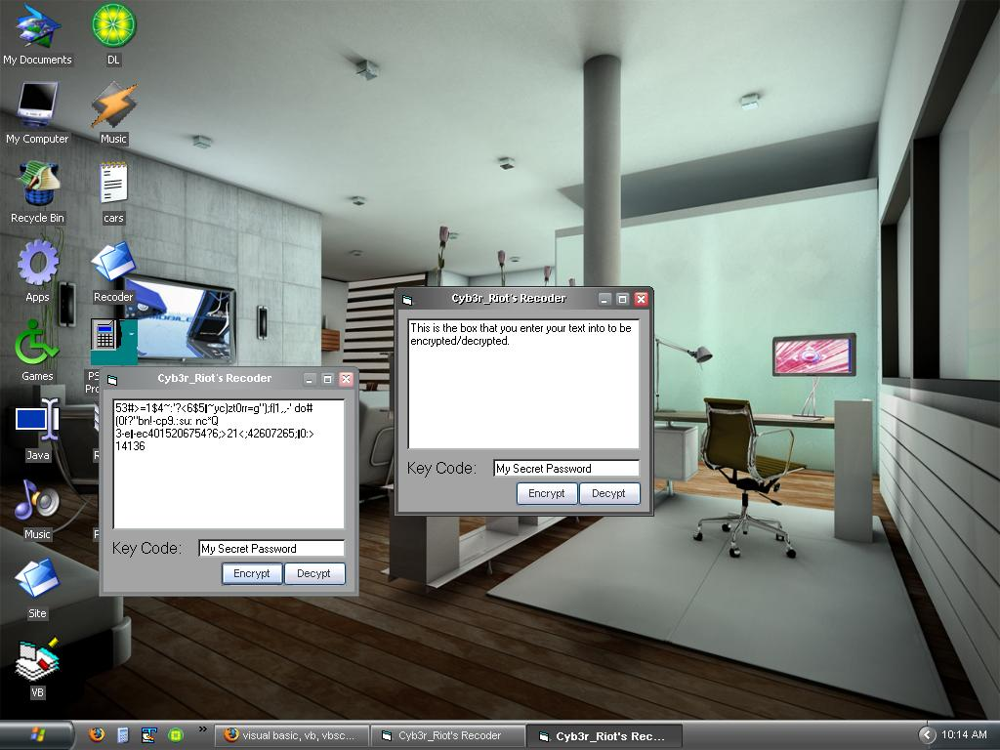

<div align="center">

## Good Encyption \- Recoder


</div>

### Description

This module will quickly encrypt any text that you give it, using the user supplied keycode. Rather than a simple xor cipher, this code will alter the code in the following ways:

1. Generate a string of random numbers and put them at the beggining of the string. This prevents a possible cracker from figuring out the beginning of the actual message.

2. Transform the key by adding itself in different ways to itself, preventing a simple frequency analysis, particularly in short messages.

3. Screw around with the current character, then change it again depending on whether it's even or odd, then xor it one more time for good measure.

4. Xor the current letter with the next letter. This makes the whole message dependent on the ecryption/decryption of each previous letter.

5. Swap the whole string around in letter-groups the integer-half size of the key (i.e.:int(keylength/2)). This makes it so that a partially decrypted string makes absolutely no sense, and helps to shuffle around words that could be analyzed and solved (like 'the', 'it', '-ing', 'of', etc).

If you like the code, voting is good, but I prefer comments and ideas. Post them here or email/YIM ajcis55@yahoo.com. Thanks!

[UPDATE} - Fixed the screenshot to show decryption!
 
### More Info
 
Plain text and keycode, or encrypted text and keycode.

Encrypted or decrypted text.


<span>             |<span>
---                |---
**Submitted On**   |
**By**             |[cyb3r\_riot](https://github.com/Planet-Source-Code/PSCIndex/blob/master/ByAuthor/cyb3r-riot.md)
**Level**          |Intermediate
**User Rating**    |4.0 (8 globes from 2 users)
**Compatibility**  |VB 4\.0 \(16\-bit\), VB 4\.0 \(32\-bit\), VB 5\.0, VB 6\.0
**Category**       |[Files/ File Controls/ Input/ Output](https://github.com/Planet-Source-Code/PSCIndex/blob/master/ByCategory/files-file-controls-input-output__1-3.md)
**World**          |[Visual Basic](https://github.com/Planet-Source-Code/PSCIndex/blob/master/ByWorld/visual-basic.md)
**Archive File**   |[](https://github.com/Planet-Source-Code/cyb3r-riot-good-encyption-recoder__1-65669/archive/master.zip)


### Source Code

```
'If you like this code, don't hesitate to vote. If you find a flaw, you can be more
'helpful and let me know. Any ideas and suggestions are also greatly appreciated.
'Comment on PSC or email/IM ajcis55@yahoo.com. Thanks!
'Ok...there's a lot going on in here. I put together pretty much everything I could
'to make this thing hard to crack. Here it is in order:
' 1. Generate a string of random numbers and put them at the beggining of the string.
'  This prevents a possible cracker from figuring out the beginning of the actual text.
' 2. Transform the key by adding itself in different ways to itself, preventing a simple
'  frequency analysis, particularly in short messages.
' 3. Screw around with the current character, then change it again depending on whether
'  it's even or odd, then xor it one more time for good measure.
' 4. Xor the current letter with the next letter. This makes the whole message dependent
'  on the decryption of the letter before it.
' 5. Swap the whole string around in letter-groups the integer-half size of the key (i.e.:int(keylength/2)). This makes it so that a partially
'  decrypted string makes absolutely no sense, and helps to shuffle around words that could
'  be analyzed and solved (like 'the', 'it', etc).
'The decryption method is not commented. This is because it should be fairly easy to
'follow by looking at the encryption method.
'Calling these methods is simple. Just call textbox=encrypt(whatever the main text is,whatever the keycode is)
'The same thing works for the decryption.
'These are just a few useful functions and operations to use in encryption. This is my first attempt,
'you can rest assured that there will be more to follow using compression, block encoding, and more.
Function Encrypt(Txt As String, Key As String) As String
Dim i As Long, NewString As String, rndtxt As String, tmp As String
stp = Int(Len(Key) / 2)
For i = 1 To (Len(Key) * 2) 'this generates a string of random numbers twice the length of the keycode
rndtxt = rndtxt & Int(Rnd * 9)
Next i
Txt = rndtxt & Txt 'put the random number string at the beginning of the txt string
Key = Key & UCase(Key) & LCase(Key) & StrReverse(Key) & (Len(Key) + Len(Key))
'above transforms the key so the it is not immediately repeated
x = 1 'x is used to cycle through the key
For i = 1 To Len(Txt)
DoEvents 'keep the program from killing the computer
Char = Asc(Mid$(Txt, i, 1)) Mod ((Len(Key) + 1) * 256) 'get the next character in txt, alter it a little, and convert to asc
keychar = Asc(Mid$(Key, x, 1)) 'get the next keycode character, convert to asc
If Int(keychar) = (keychar / 2) Then keychar = keychar * 2 Else keychar = Asc(Hex(keychar))
'above changes the next letter depending on if it is even or odd
nxt = (Char Xor keychar) 'xor again
If i > 1 Then nxt = nxt Xor Asc(Mid$(Txt, i - 1, 1)) 'xor the current character with the previous character
NewString = NewString & Chr(nxt) 'add the current letter to the rest of the string
x = x + 1 'next character of keycode
If x > Len(Key) Then x = 1 'reset x to 1 if at the end of keycode
Next i
For i = Len(NewString) To 1 Step -(stp)
'this will rearrange the encoded txt string in 3letter-groups half the size of the key length
If i < stp Then tmp = tmp & Left$(NewString, i): Exit For
tmp = tmp & Mid$(NewString, i - (stp - 1), stp)
Next i
Encrypt = tmp 'return the new, encrypted string
End Function
Function Decrypt(Txt As String, Key As String) As String
Dim i As Long, x As Integer, NewString As String, tmp As String, origKey As String
stp = Int(Len(Key) / 2)
For i = 1 To Len(Txt) Step stp
If i > Len(Txt) - stp Then tmp = Mid$(Txt, i) & tmp: Exit For
tmp = Mid$(Txt, i, stp) & tmp
Next i
Txt = tmp
origKey = Key
Key = Key & UCase(Key) & LCase(Key) & StrReverse(Key) & (Len(Key) + Len(Key))
tmp = 0
x = 1
For i = 1 To Len(Txt)
DoEvents
nxt = Asc(Mid$(Txt, i, 1))
nxt = nxt Xor tmp
Char = nxt Mod ((Len(Key) + 1) * 257 + nxtcode)
keychar = Asc(Mid$(Key, x, 1))
If Int(keychar) = (keychar / 2) Then keychar = keychar * 2 Else keychar = Asc(Hex(keychar))
nxt = (Char Xor keychar)
tmp = nxt
NewString = NewString & Chr(nxt)
x = x + 1
If x > Len(Key) Then x = 1
Next i
Key = origKey
NewString = Right$(NewString, Len(NewString) - (Len(Key) * 2))
Decrypt = NewString
End Function
```

